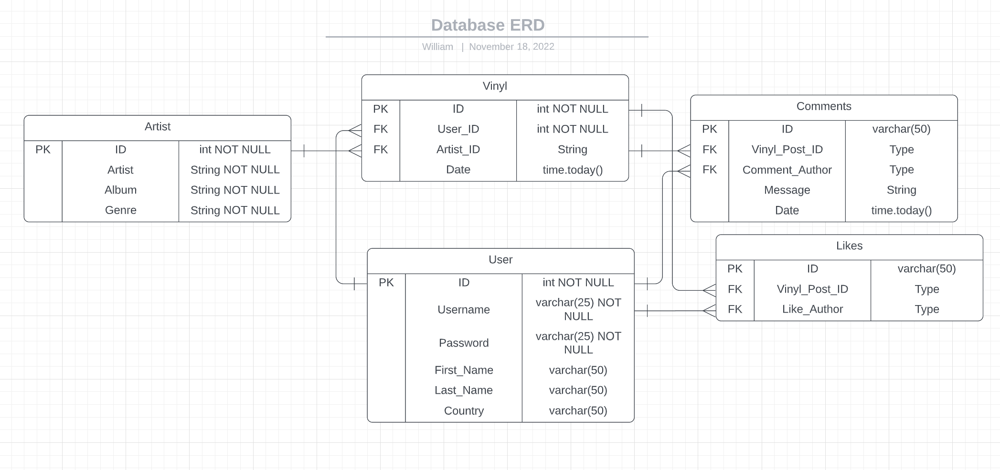

# WilliamOtto_T2A2

## Index  
- [R1 - Identification of the problem you are trying to solve by building this particular app](#r1)  
- [R2 - Why is it a problem that needs solving](#r2)  
- [R3 - Why have you chosen this database system. What are the drawbacks compared to others?](#r3)  
- [R4 - Identify and discuss the key functionalities and benefits of an ORM](#r4)  
- [R5 - Document all endpoints for your API](#r5)
- [R6 - Make an ERD for the app](#r6)
- [R7 - Detail any third party services that your app will use](#r7)
- [R8 - Describe your projects models in terms of the relationships they have with each other](#r8)
- [R9 - Discuss the database relations to be implemented in your application](#r9)
- [R10 - Describe the way tasks are allocated and tracked in your project](#r10)

# R1
The purpose of this project is to provide people a way to catalogue their person vinyl collections. Users can add friends to see what they have in their collections, comment/like on these posts, and access a database of artists in the catalogue. The users will be able to search by artist, genre or album.
# R2
As vinyl collections are purely physical, for some people, there is a desire to be able to catalogue their vinyl collections and share it with others, making it a more social experience.
# R3
My database system of choise is PostgreSQL. The main reasons for using PostgreSQL are as follows:

Pros:

- Open sourced.
- Free and accessible to everyone.
- Customisable with access to a multitude of plugins.
- Used by many large companies such as Apple and Cisco.
- Many resources for troubleshooting due to its popularity.

Cons:

- Being open sourced can cause problems with compatibility between different companies that use different plugins.
- Being a relational database system means that search queries are read sequentially which is detrimental to performance.

# R4
ORM is a technique that lets you manipulate data from a database using an object oriented programming language. Because the ORM is written in your language of choice, it circumnavigates the need for SQL queries. This means that the output can be more easily understood than if it were displayed as SQL. Consequently, it becomes more efficient in speed of production, and error mitigation.

ORM can improve security of the database. This is because any queries must go through the ORM, and, as a feature of the ORM technique is to provide authentication and validation whenever necessary, this provides an additional layer of security.

Accessing data in an ORM system is easier thanks to the fact that it is able to control how certain objects relate to different schema within a database. The CRUD operations form the basis for this communication between schema.

The disadvantages of an ORM system is that it is inherently slower than direct SQL queries as it has a higher level of abstraction. It also takes time to learn and understand how to implement it.

# R5

## Authorization Endpoints
### auth/login
Method: POST
Identifier: Email
Authentication: Email and password
Token: JWT
Description: User can log in which generates a JWT which is used for authentication.

### auth/register
Method: POST
Identifier: None
Authentication: None
Token: None
Description: Creates a new user.

### auth/users
Method: GET
Identifier: None
Authentication: None
Token: None
Description: Shows a list of all users, with vinyls that have been posted.

### auth/users/id
Method: GET
Identifier: None
Authentication: None
Token: None
Description: displays all vinyls of one user including comments and likes.

## Vinyls Endpoints:
### vinyl/
Method: GET
Identifier: None
Authentication: None
Token: None
Description: Displays all vinyls with genre, album and user information for the user(s) that made the post.

### vinyl/
Method: POST
Identifier: None
Authentication: None
Token: None
Description: Creates a new vinyl

### vinyl/
Method: PUT, PATCH
Identifier: None
Authentication: None
Token: None
Description: Updates a specific vinyl.

### vinyl/
Method: DELETE
Identifier: None
Authentication: None
Token: None
Description: Deletes a specific vinyl.

## Artist Endpoints:
### artist/
Method: GET
Identifier: None
Authentication: None
Token: None
Description: Get all artists

### artist/<string:artist.artist>
Method: GET
Identifier: None
Authentication: None
Token: None
Description: Get all songs and albums by an artist

### artist/genre>
Method: GET
Identifier: 
Authentication: 
Token: 
Description: Get all artists by genre

### artist/albums>
Method: GET
Identifier: 
Authentication: No
Token: 
Description: Get all albums by artist

### artist/>
Method: POST/PATCH
Identifier: 
Authentication: 
Token: 
Description: 

### artist/>
Method: DELETE
Identifier: 
Authentication: 
Token: 
Description: 

## CLI Endpoints:
### cli/>
Method: DELETE
Identifier: 
Authentication: 
Token: 
Description: 

# R6

# R7
- Flask
- Marshmallow
- Flask-Marshmallow
- SQLAlchemy
- BCrypt
- Psycopg
- PostreSQL

# R8
## Artist Model:

# R9

# R10
